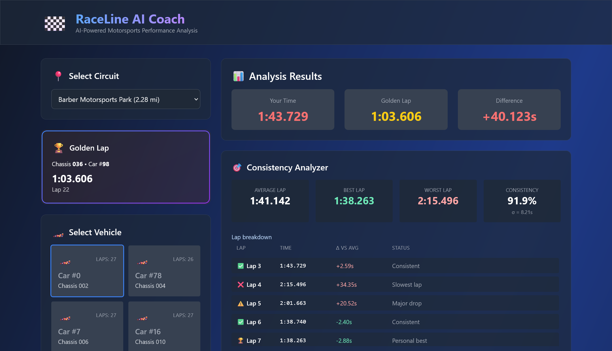
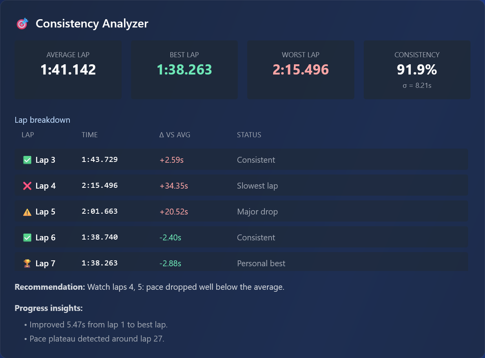
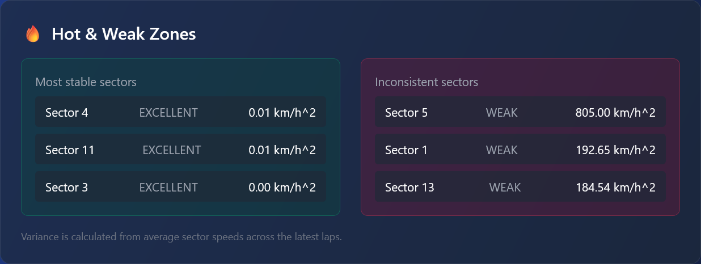

# RaceLine AI Coach — Project Overview

RaceLine AI Coach transforms raw GR Cup telemetry into coaching insights that any driver can use. This document captures the product story, architecture, hosting strategy, and implementation details that power the experience.

## 1. Product Vision

- **Audience**: Toyota GR Cup drivers and coaches who need detailed, objective feedback.
- **Goal**: Turn 17 GB of raw lap telemetry into an interactive experience that highlights pace gaps, hot zones, and actionable tips in seconds.
- **Key outcomes**:
  - Identify “where” and “why” a driver loses time (maps + charts)
  - Surface the three most impactful improvement areas automatically
  - Offer AI-generated recommendations tailored to the selected lap

### Feature Tour

| View | Description |
| --- | --- |
|  | Animated lap comparison with ghost cars and sector annotations (also available as GIF/video for presentations). |
|  | Flags outlier laps, shows average/best/worst, and provides a consistency score. |
|  | Highlights momentum gains/losses along the lap with tooltip-rich segments. |
|  | Summarizes sectors with high variance and exposes detailed stats per segment. |
|  | Speed trace, lap progression, hot-zone variance, and race timeline charts pair numbers with visuals. |
|  | Gemini-powered summary and up to five targeted recommendations. |

### Motion Preview

> 🎞️ Animated lap comparison with ghost markers and sector highlights.  
> 📹 [Full video walkthrough (MP4).](medias/lap-comparizon-map-video.mp4)

## 2. Architecture & Hosting

> Project Architecture. 

1. `/data/**` folders → auto CSV ➜ Parquet conversion and caching
2. FastAPI serves normalized telemetry + lap summaries
3. Gemini receives JSON payloads and returns coaching tips
4. Frontend consumes REST endpoints and renders the interactive UI

- **Frontend**: Hosted on **Firebase Hosting** with automatic SSL, CDN caching, and CLI-based deployments.
- **Backend**: Containerized FastAPI app designed for **Google Cloud Run** (0 → N auto-scaling, pay-per-use). The container bundles the processed `data/` folder or mounts it from Google Cloud Storage if the dataset is stored externally.
- **Data storage**: No external DB; the Parquet conversion pipeline keeps the processed dataset inside the project (773 MB vs 17 GB raw CSV). Cloud Run instances can either bake the Parquet files into the image or download them from Cloud Storage at startup.
- **Runtime commands**: Locally, developers simply run `python3 main.py` in `backend/` (the script already boots uvicorn). The same command is used in the Cloud Run container entrypoint, keeping dev/prod parity.

## 3. Data Processing Pipeline

1. **Circuit discovery**: Every subdirectory under `/data` is inspected. Mixed naming conventions like `vir_lap_time_R2.csv` or `sebring_telemetry_R1.csv` are handled through regex patterns.
2. **Auto conversion**: On startup, `RaceDataProcessor` converts every matching CSV (telemetry/lap_start/lap_end/lap_time) into Parquet and deletes the CSV to save space.
3. **Lap event cache**: Lap start/end/time events are cached once per circuit/race and reused for vehicle lists, consistency metrics, and golden-lap detection.
4. **Telemetry prep**:
   - Wide pivot of telemetry rows
   - Column normalization (aliases `ath → aps`, ensures `Laptrigger_lapdist_dls` exists, integrates distance if missing)
   - Missing GPS or pedal channels are defaulted to safe values
5. **Golden lap detection**: Sorts laps by lap time and returns the fastest lap that still has telemetry; laps without telemetry are skipped automatically.
6. **AI payloads**: After comparison, FastAPI serializes the result with numpy-safe converters, then Gemini 2.5 Pro generates natural-language insights.

> **Compression win**: The full dataset (multiple circuits × races) starts at >17 GB of CSVs. After automatic Parquet conversion we sit around 773 MB — an ~96% size reduction, dramatically reducing memory and cold-start costs on Cloud Run.

We used these datasets:
1. barber-motorsports-park.zip
2. circuit-of-the-americas.zip
3. indianapolis.zip
4. road-america.zip
5. sebring.zip
6. sonoma.zip
7. virginia-international-raceway.zip

## 4. Frontend Experience

- **Circuit & lap selectors**: Paginated vehicle grid (with 🏎️ badges) and lap cards with delta vs golden lap.
- **Maps**: Lap comparison, consistency heatmap, flow dynamics, and ghost lap tabs share legend + controls.
- **Coach tabs**: “🎯 Top 3 Areas to Improve”, “🤖 AI Coach Insights”, and “🌤️ Weather” are organized into tabs so the panel remains compact.
- **Charts**: Speed trace, lap progression, hot-zone variance, and race timeline are grouped into tabs with helpful empty states.

Each screen has a corresponding capture in [`docs/medias/`](medias/) for pitch decks or documentation.

## 5. Deployment Notes

| Layer | Platform | Details |
| --- | --- | --- |
| Frontend | Firebase Hosting | Deploy the `frontend/` folder. Use rewrite rules to fallback to `index.html`. |
| Backend | Cloud Run | Build the `backend/` container, copy the `data/` folder, expose port 8000. Configure `GEMINI_*` env vars in Cloud Run. |
| Dataset | Bundled | Keep the compressed Parquet files inside the image or download from Cloud Storage on boot. |

## 6. Future Enhancements

- Add authentication for multi-driver accounts
- Integrate video overlays synced with telemetry
- Expand AI coach to support multi-lap trend analysis
- Offer downloadable PDF coaching reports

---

For step-by-step usage instructions, see [`docs/user-guide.md`](user-guide.md).
